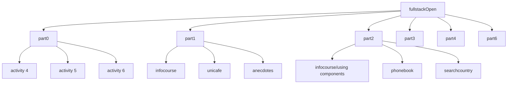

# Directory tree

```mermaid
graph TD
  A[fullstackOpen]
  A --> B[part0]
  A --> C[part1]
  A --> D[part2]
  A --> E[part3]
  A --> F[part4]
  A --> G[part6]
  B --> H[activity 4]
  B --> I[activity 5]
  B --> J[activity 6]
  C --> K[infocourse]
  C --> L[unicafe]
  C --> M[anecdotes]
  D --> N[infocourse/using components]
  D --> O[phonebook]
  D --> P[searchcountry]
```

<!-- Const Var -- pending -->
