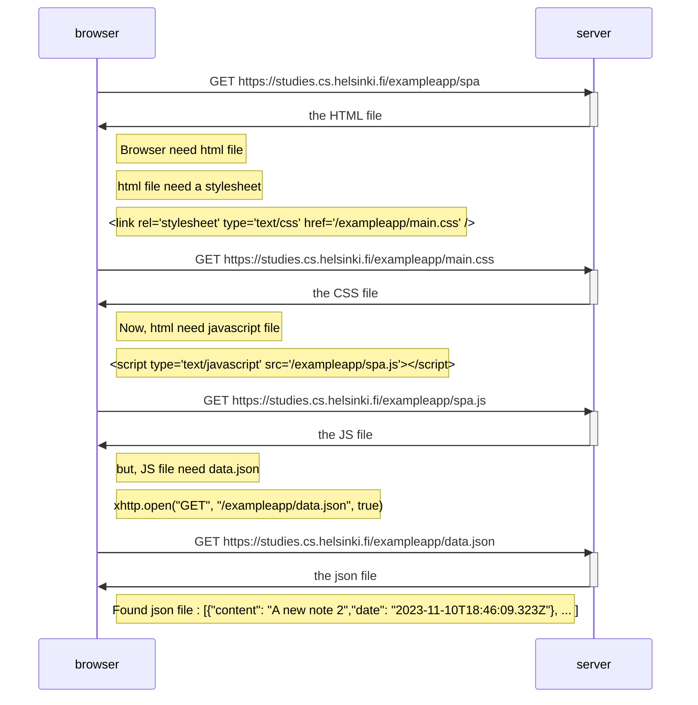

# Activity 5

Here is sequence diagram for an aplication of one page

```mermaid
sequenceDiagram
  participant browser
  participant server  

  browser->>server: GET https://studies.cs.helsinki.fi/exampleapp/spa
  activate server
  server->>browser: the HTML file
  deactivate server
  note right of browser: Browser need html file
  note right of browser: html file need a stylesheet
  note right of browser:<link rel="stylesheet" type="text/css" href="/exampleapp/main.css" />
  browser->>server: GET https://studies.cs.helsinki.fi/exampleapp/main.css
  activate server
  server->>browser: the CSS file
  deactivate server
  note right of browser: Now, html need javascript file
  note right of browser: <script type="text/javascript" src="/exampleapp/spa.js"></script>
  browser->>server: GET https://studies.cs.helsinki.fi/exampleapp/spa.js
  activate server
  server->>browser: the JS file
  deactivate server
  note right of browser: but, JS file need data.json
  note right of browser: xhttp.open("GET", "/exampleapp/data.json", true)
  browser->>server: GET https://studies.cs.helsinki.fi/exampleapp/data.json
  activate server
  server->>browser: the json file
  deactivate server
  note right of browser: Found json file : [{"content": "A new note 2","date": "2023-11-10T18:46:09.323Z"}, ... ]
```